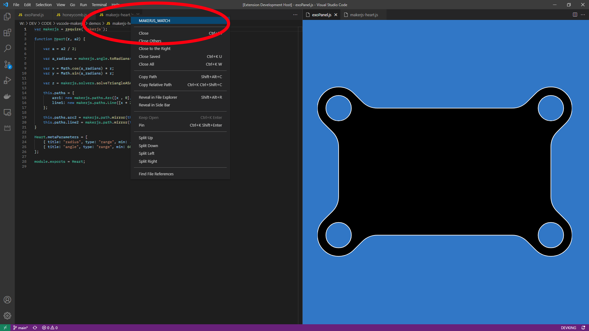

# VS Code <a href='https://maker.js.org'>MakerJS</a> Preview Addon

---

#### <code><a href='https://github.com/cogsmith/vscode-makerjs'> [GITHUB REPO]</a></code>

#### <code><a href='https://marketplace.visualstudio.com/items?itemName=COGSMITH.vscode-makerjs'>🏬 [VISUAL STUDIO MARKETPLACE]</a></code>

#### <code><a href='https://github.com/cogsmith/vscode-makerjs/blob/main/extension.js'>🧾 [VIEW EXTENSION SOURCE CODE]</a></code>

#### <code><a href='https://github.com/cogsmith/vscode-makerjs/projects/1'>📅 [PROJECT TRACKER BOARD]</a></code>

---

<!--  -->

---

# FEATURES

* Renders MakerJS Models Inside VS Code
* Saves Generated SVG Alongside JS Source
* Update Preview Window Automatically On Save

# HOWTO

* Right Click MakerJS Text File Header
* Select MAKERJS_WATCH From Context Menu

---

